## PYNQ使用说明书

### 烧录PYNQ镜像与启动

- 解压得到img镜像文件
- 使用读卡器读取SD卡并连接PC
- 以管理员身份打开Win32DiskImager镜像烧录软件
- 选择镜像文件以及SD所在盘符并烧录
- 将SD插回开发板，设置开发板启动模式为SD

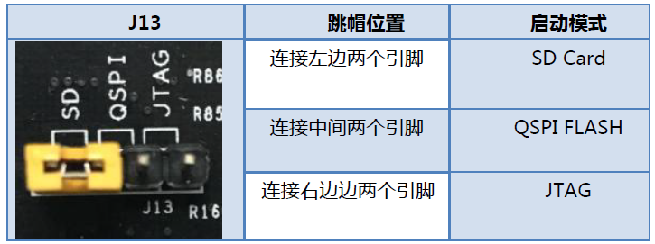

- 连接电源、UART、网线直插PC(IP为192.168.2.99)
- win + Q 搜索‘适配器’，将以太网->属性->IPV4->使用下列地址：192.168.2.100；子网掩码为255.255.255.0
- 打开putty以及设备管理器，展开端口列表找到USB端口号：COM*，我的设备为COM5
- 打开浏览器，输入http://192.168.2.99:9090，输入密码为xilinx即可进入Jupyter Notebook主页

- 传输文件可以打开资源管理器，输入 **\\\pynq\xilinx** 即可连接

### 板卡连接外网
- win + Q 搜索适配器，点击更多适配器(win11)
- 找到主机连接的外网，右击此网络 -> 属性 -> 共享 -> 勾选Internet连接 -> 选择板卡以太网
- 此时主机的pc为192.168.137.1
- 在主机通过PuTTy连接板卡，输入 ```sudo vim /etc/network/interfaces```
- 将开发板的IP设置为192.168.137.5，修改如下内容：

```
auto eth0
iface eth0 inet static
address 192.168.137.5 
netmask 255.255.255.0
gateway 192.168.137.1

source-directory /etc/network/interfaces.d
```
- 重启网卡 ```sudo /etc/init.d/network-manager restart```
- 然后主机和板卡相互ping，板卡ping baidu.com
- 如果ping不通，可以修改默认路由

```
sudo route del default
sudo route add default gw 192.168.137.1 netmask 0.0.0.0
```
- 如果还是ping不通，设置域名解析服务器

```
echo "nameserver 8.8.8.8" >> /etc/resolv.conf
```

### orerlay介绍

overlay是硬件库，是FPGA生成的bit文件在PYNQ的调用，通过pynq来实现调用

```
from pynq import Overlay
overlay = Overlay("base.bit")
```

此外，pynq还提供了一些标准示例的base_overlay，同样可以铜鼓pynq进行调用

```
from pynq.overlays.base import BaseOverlay
base_overlay = BaseOverlay("base.bit")
```

### overlay设计
overlay主要包括两个组件：bitstream以及block diagram的tcl文件，创建overlay需要很多的组件：
- Board Settings
- PS-PL Interface
- MicroBlaze Soft Processors
- Python/C Integration
- Python AsyncIO
- Python Overlay API
- Python Packaging

**TCL**文件可以通过Vivado的图形界面或Tcl console产生：

```
File -> Export -> Block Design
or
write_bd_tcl
```

Tcl文件的名字需要和bitstream名字相一致，否则pynq在加载overlay时会报错

已有的base_overlay可以在 _/boards//base_ 找到

#### 开发IP

可以使用HLS生成IP，在Vivado block design中，需要一些其他的逻辑连接到ZYNQ的PS侧，随后生成bitstream和tcl文件。通过读取hls代码获得如何使用ip；通过overlay?获得overlay的信息。随后就可以通过overlay.write('addr','data')、overlay.read('addr','data')使用ip

- 创建project，项目名与IP核一样
- 按照提示添加设计文件(.cpp)、测试文件(.cpp)，并将测试文件的 **CFLAGS** 改成 **-DHW_COSIM**
- 输入时钟周期(单位为ns)，选择设备编号 **xc7z020clg400-2**

#### 仿真-原型验证

- 在test函数通过设置 **HW_COSIM** 判断自定义函数是否正确。点击 project -> run c simulation完成仿真

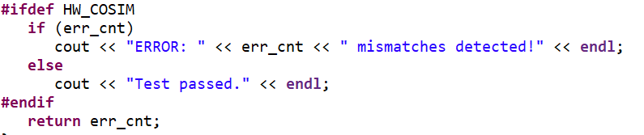

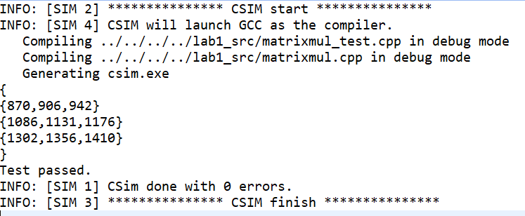

#### 综合-生成v代码

- 仿真验证结束后(判断自定义函数是否有问题)，可以进行综合。Solution > Run C Synthesis > Active Solution。将会给出综合后的信息以及生成的文件

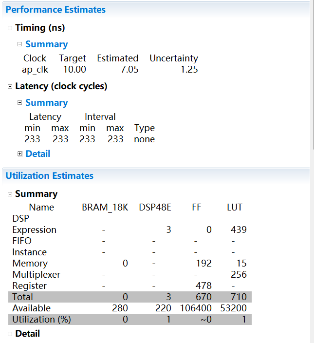

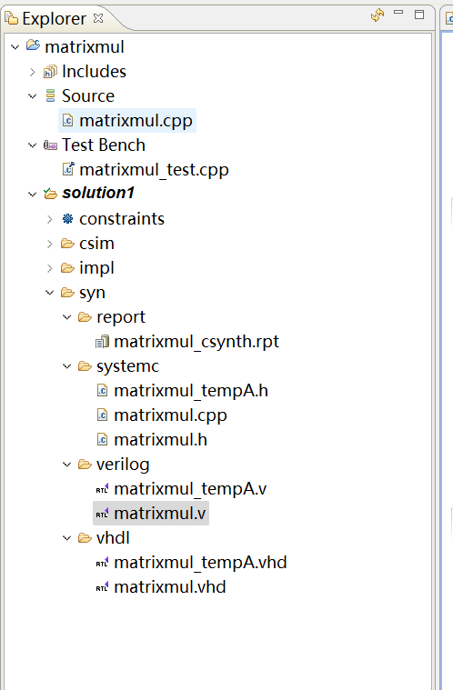

#### C/V联合仿真

- 点击 Solution -> Run C/RTL Cosimulation
- 仿真器为 **Vivado Simulator**，语言为 **Verilog** ，Dunp Trace为 **all**
- 仿真结束会给出仿真报告，并且可以查看波形

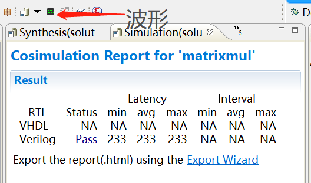

#### ecport RTL

- 点击Solution -> Export RTL
- Format selection选择**IP Catalog**，并选中**Vivado synthesis, place and route**

在到处RTL是可能会出现无法导出IP，错误信息如下。可以参考[链接](https://blog.csdn.net/qq_45862617/article/details/122854613)进行修复

```
command 'ap_source' returned error code
    while executing
"source D:/File/UCAS/PYNQ/hls_labs/lab1/matrixmul/solution1/export.tcl"
    invoked from within
"hls::main D:/File/UCAS/PYNQ/hls_labs/lab1/matrixmul/solution1/export.tcl"
    ("uplevel" body line 1)
    invoked from within
"uplevel 1 hls::main {*}$args"
    (procedure "hls_proc" line 5)
    invoked from within
"hls_proc $argv"
```

- 修复完成后重新export RTL，可以得到如下结果


- 生成的ip位于**solution1/impl/ip/xilinx_com_hls_matrixmul_1_0.zip**

#### 添加 HLS directive 约束

- 点击project -> new solution
- 在solution2中双击源文件，在Directive窗口，点击matrixmul后右键，将会出现对函数顶层模块插入Directive的选项；对顶层进行如下配置

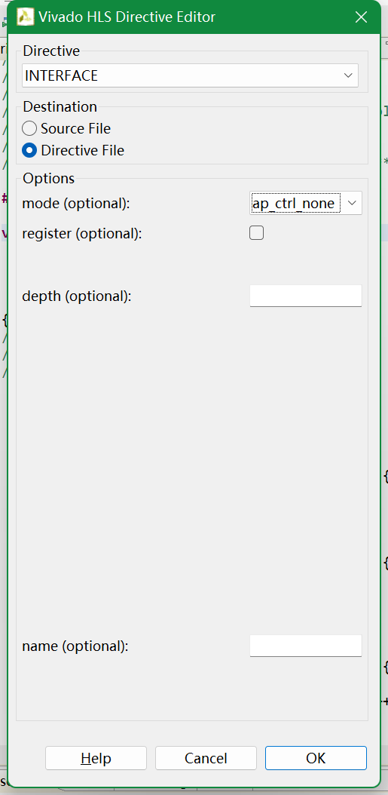

- 对参数a、b、res和test添加如下directive

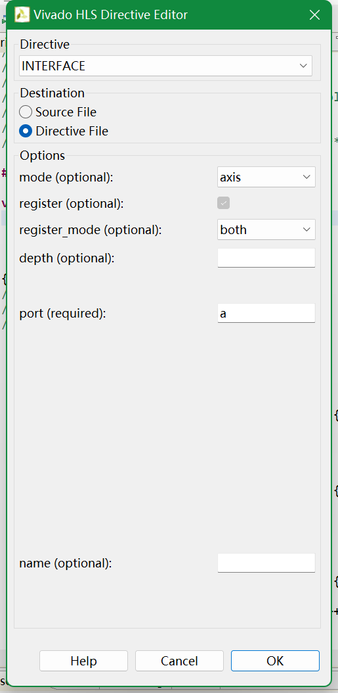

- 对col添加如下约束

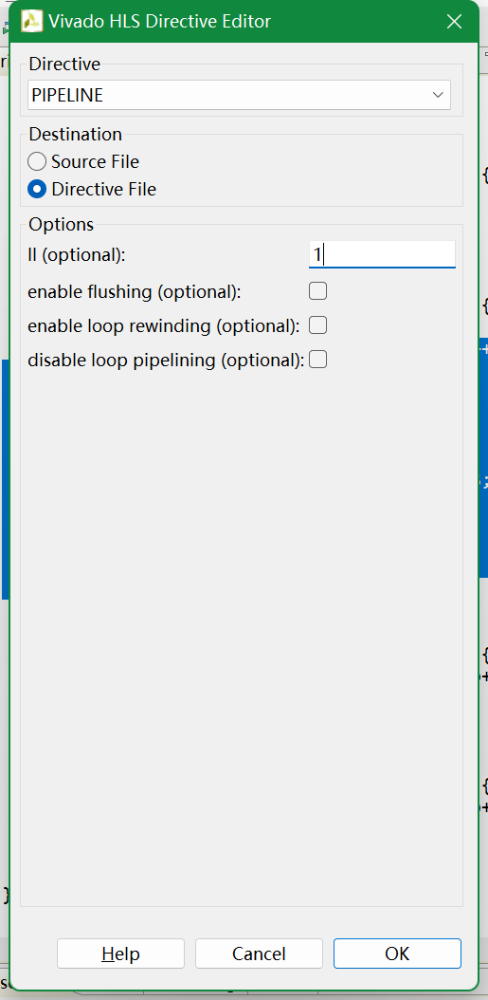

- 上述所有的directives均在**directives.tcl**里

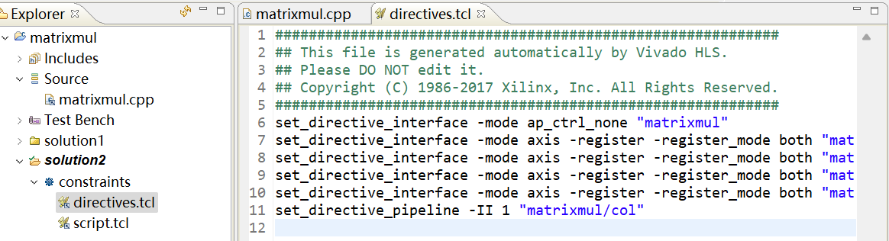

- 对solution2进行综合，Solution > Run C Synthesis > Active Solution
- 再export IP
- 至此HLS的IP生成已经结束，可以关闭HLS软件

#### 创建vivado-例化HLS IP到工程中并生成
- 打开vivado2017.4，新建project，project name与ip一致
- 其余一直NEXT，开发板选择 **xc7z020clg400-2**
- 将刚刚生成的zip包(solution2)拷贝到Vivado工程的.ip.user_files后解压缩；
- 添加IP

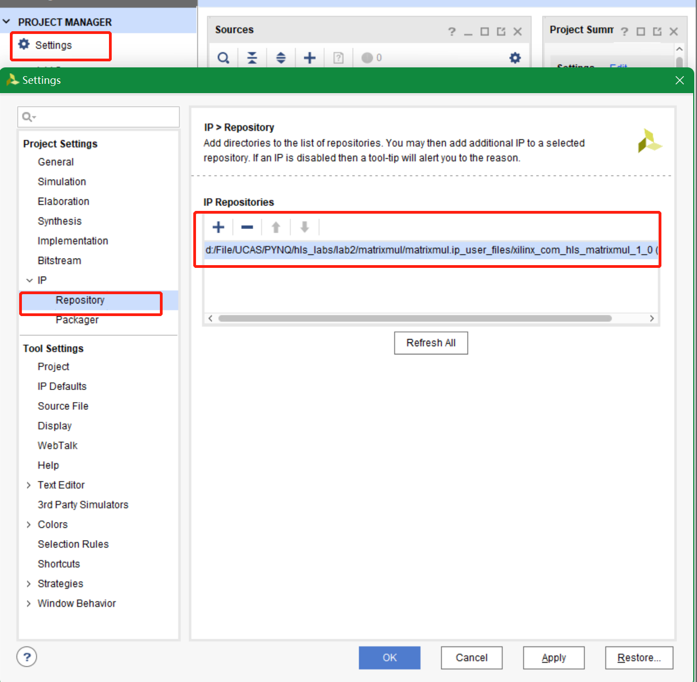

- 创建Block Design，并添加ZYNQ7 Processing System IP到Block Design


- 点击Run Block Automation，保持默认配置，点击OK；
- 双击ZYNQ7 Processing System IP，添加HP0接口

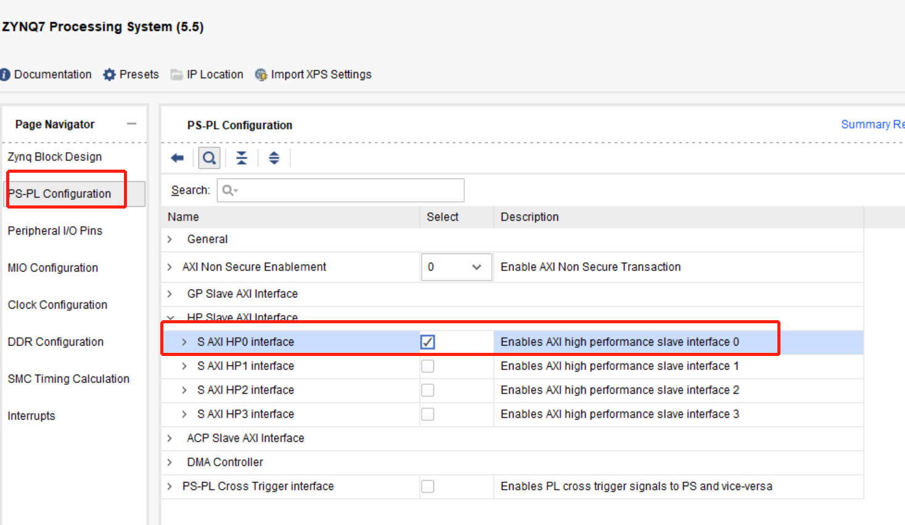

- 例化Matrixmul到Block Design，通过AXI DMA将IP连接到PS端，如下图所示

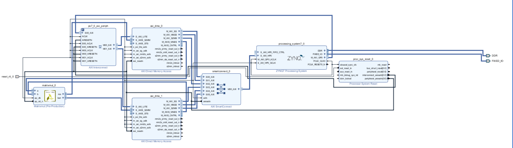

- 创建 HDL Wrapper文件，右键design_1，点击create HDL Wrapper

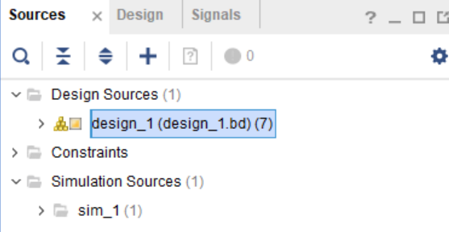

- 生成 Bitstream，在flow navigator点击generate bitstream。在生成bitstream时，可能会出现以下错误，可以参考[博客](http://t.zoukankan.com/jason20-p-13143253.html)进行处理

```
[DRC NSTD-1] Unspecified I/O Standard: 1 out of 131 logical ports use I/O standard (IOSTANDARD) value 'DEFAULT', instead of a user assigned specific value. This may cause I/O contention or incompatibility with the board power or connectivity affecting performance, signal integrity or in extreme cases cause damage to the device or the components to which it is connected. To correct this violation, specify all I/O standards. This design will fail to generate a bitstream unless all logical ports have a user specified I/O standard value defined. To allow bitstream creation with unspecified I/O standard values (not recommended), use this command: set_property SEVERITY {Warning} [get_drc_checks NSTD-1].  NOTE: When using the Vivado Runs infrastructure (e.g. launch_runs Tcl command), add this command to a .tcl file and add that file as a pre-hook for write_bitstream step for the implementation run. Problem ports: reset_rtl_0.

```

- 生成TCL文件，先点击IP INTEGRATOR，然后点击file -> export -> export block design
- bit文件在.runs/impl_1文件夹，tcl在自定义的文件夹，将这两个文件复制到其他地方并与顶层名相一致，例如matrixmul.tcl与matrixmul.bit

**之后就可以使用overlay了**